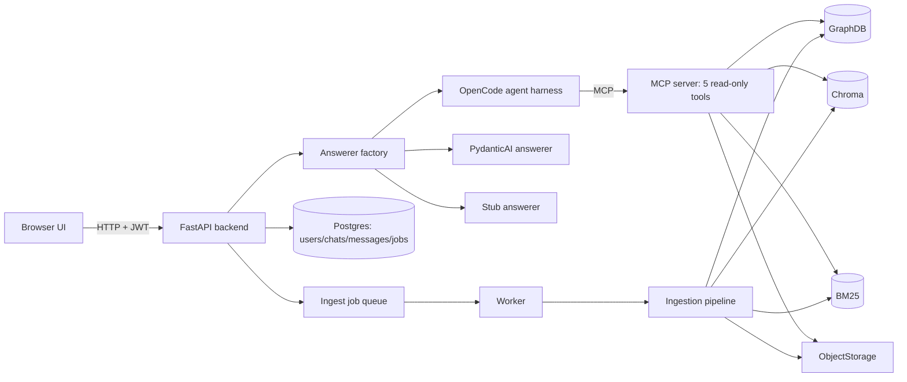
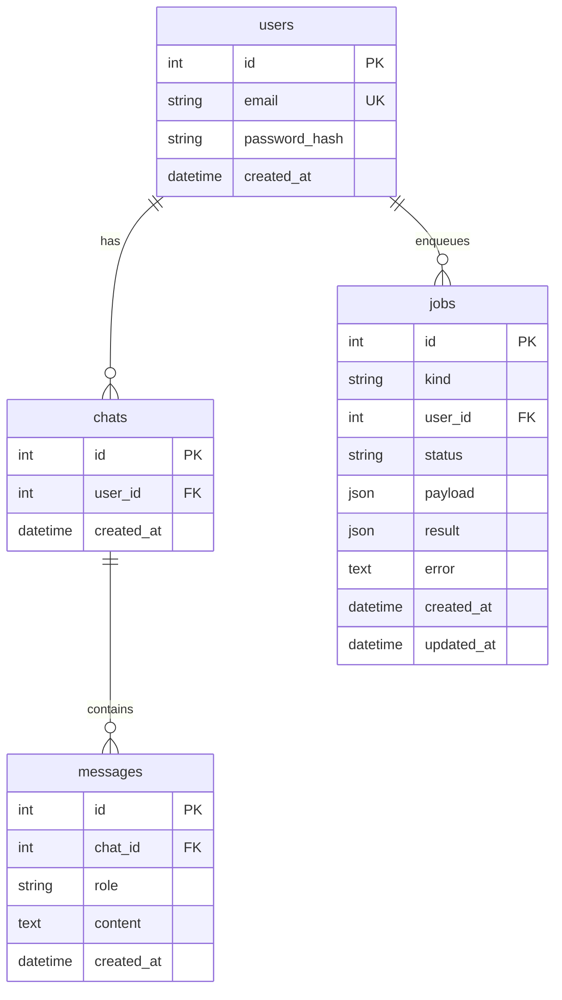
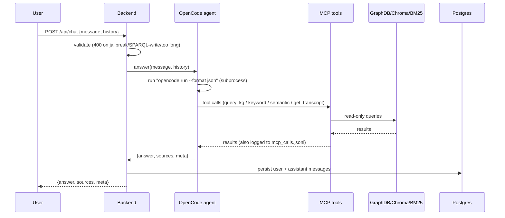
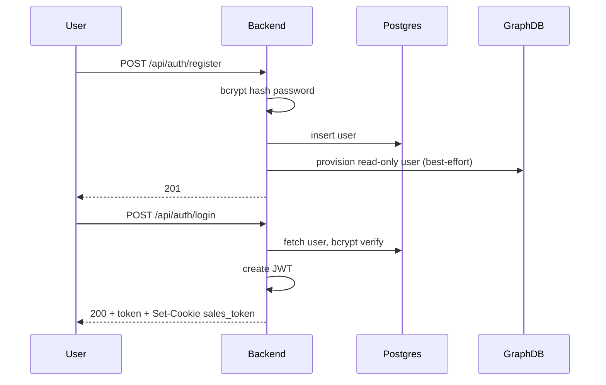
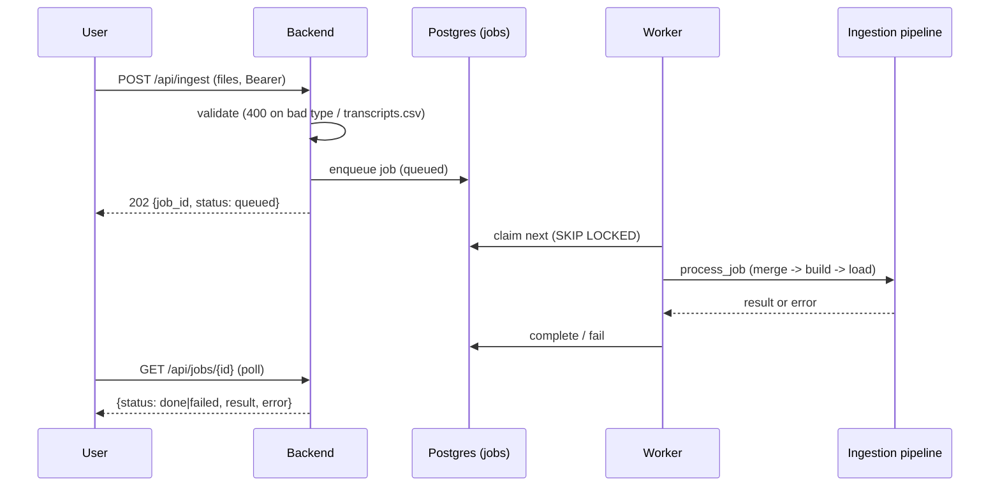

# Architecture — Sales Intelligence Assistant

A prototype that answers sales questions by grounding an LLM agent in a
knowledge graph, a vector index and a keyword index.

---

## 1. What it does

- For this challenge, it was assumed that data has the format below, but a general solution for flexible schemas is discussed at the end.
- Answers sales questions about CRM data such as deals, accounts, contacts and transcripts.
- Grounds every answer in real data (KG + transcripts), not the model's memory.
- Lets you upload CRM CSVs and transcript rows (async jobs).
- Shows evidence per answer: which tool, what it found, links into GraphDB.
- Has accounts (register / login), per-user chat history, and "clear chat".
- Blocks dangerous input: SPARQL writes, jailbreaks, oversized prompts.

## 2. Requirements

- **Read-only agent.** The agent can only call 5 retrieval tools. No shell, no
  filesystem, no HTTP, no DB credentials.
- **Grounded answers.** Every factual claim is backed by a tool result, and the
  UI shows the source.
- **Async ingestion.** Uploads return immediately; a worker runs the pipeline.
- **Per-user isolation.** Chats and jobs are scoped to the logged-in user.
- **Deterministic safety first.** A hard validator always runs; the classifier
  is optional.

## 3. Input data — fixed CRM schema

The system expects two kinds of input, both expressed as CSVs.

<div style="max-height: 400px; overflow-y: auto; border: 1px solid #ccc; padding: 8px 12px;">

<p><strong>Structured CRM tables</strong> — five files joined by <code>account_id</code> / <code>deal_id</code> / <code>contact_id</code> / <code>owner_id</code>. One real sample record per file (<code>datasets/first_ingestion/</code>):</p>

<strong><code>accounts.csv</code></strong>
<table>
  <thead><tr><th>account_id</th><th>account_name</th><th>industry</th><th>country</th><th>employee_count</th><th>annual_revenue_eur</th><th>account_tier</th><th>created_at</th></tr></thead>
  <tbody><tr><td>A001</td><td>Acme Manufacturing</td><td>Manufacturing</td><td>Germany</td><td>2400</td><td>420000000</td><td>Enterprise</td><td>2025-11-03</td></tr></tbody>
</table>

<strong><code>deals.csv</code></strong>
<table>
  <thead><tr><th>deal_id</th><th>account_id</th><th>deal_name</th><th>deal_stage</th><th>deal_value_eur</th><th>product</th><th>lead_source</th><th>owner_id</th><th>created_at</th><th>expected_close_date</th><th>win_probability</th><th>status</th><th>loss_reason</th></tr></thead>
  <tbody><tr><td>D001</td><td>A001</td><td>Acme Enterprise Expansion</td><td>Negotiation</td><td>120000</td><td>Enterprise Platform</td><td>Conference</td><td>S017</td><td>2026-05-10</td><td>2026-09-30</td><td>0.75</td><td>Open</td><td>—</td></tr></tbody>
</table>

<strong><code>contacts.csv</code></strong>
<table>
  <thead><tr><th>contact_id</th><th>account_id</th><th>first_name</th><th>last_name</th><th>job_title</th><th>department</th><th>seniority</th><th>email</th><th>phone</th><th>is_decision_maker</th></tr></thead>
  <tbody><tr><td>C001</td><td>A001</td><td>Anna</td><td>Keller</td><td>VP Operations</td><td>Operations</td><td>VP</td><td>anna.keller@acme.example</td><td>+49-555-0101</td><td>True</td></tr></tbody>
</table>

<strong><code>activities.csv</code></strong>
<table>
  <thead><tr><th>activity_id</th><th>deal_id</th><th>account_id</th><th>contact_id</th><th>activity_type</th><th>activity_at</th><th>channel</th><th>subject</th><th>sentiment</th><th>next_step</th><th>transcript_text</th></tr></thead>
  <tbody><tr><td>ACT001</td><td>D001</td><td>A001</td><td>C001</td><td>Meeting</td><td>2026-08-28 10:00</td><td>Video</td><td>Commercial negotiation</td><td>Positive</td><td>Send revised enterprise pricing</td><td>Anna said the solution fits their operational goals, but asked for a stronger volume discount if they expand to three factories.</td></tr></tbody>
</table>

<strong><code>transcripts.csv</code></strong>
<table>
  <thead><tr><th>transcript_id</th><th>deal_id</th><th>account_id</th><th>contact_ids</th><th>activity_date</th><th>channel</th><th>transcript</th></tr></thead>
  <tbody><tr><td>T001</td><td>D001</td><td>A001</td><td>C001;C002</td><td>2026-09-10</td><td>Sales Call</td><td>Sarah (Sales): Last time you mentioned that you were considering deployment across three factories…</td></tr></tbody>
</table>

<p>The <code>transcript</code> cell is one multi-line string. A snippet of <code>T001</code>:</p>

<pre>Sarah (Sales): Last time you mentioned that you were considering deployment across three factories. Is that still the plan?
Anna Keller: Yes. The first factory is basically approved internally. The main question is whether we can justify expanding to all three this year.
Sarah: What's preventing that decision?
Anna Keller: Mostly pricing. If we deploy at all three locations, procurement expects a better price than what is currently in the proposal.
Markus Vogel: From my side, I also still need confirmation regarding SSO and data residency.</pre>

</div>

**Transcripts** — the raw call/meeting/email text (`transcript` column) plus
metadata tying it to a deal, account and contacts. Each transcript is ingested
three ways: into the KG (LLM extraction → RDF), into Chroma (embeddings) and
into BM25 (keywords).

> **Hardcoded assumption (current build).** The system is designed for exactly
> this *one* CRM schema. The CSV tables and columns are static; the R2RML
> mapping (`mappings.ttl`) hand-wires each CSV column to an ontology term; the
> ontology itself was pregenerated and is fixed. There is **no** automatic
> support for new tables, columns, or relationships — an unknown table name or
> a column mismatch is rejected at ingest time (`merge_csv_files`).
>
> How this could be relaxed (schema/ontology discovered at ingest time instead
> of hardcoded) is described in §14, as an experimental idea, not something the
> prototype implements today.

## 4. Questions and answers

### What questions it answers

The assistant answers *sales* questions grounded in the CRM data and the
transcripts. In practice they fall into a few shapes:

| Shape | Example | Primary source |
|-------|---------|----------------|
| Structured deal facts | "What is the current stage and value of D001?" | KG |
| Semantic sales facts | "What is blocking D001?" / "What decision criteria exist for D007?" / "What buying signals exist for D001?" | KG |
| Evidence / quotes | "What exactly did the customer say about security?" / "What transcript evidence supports the pricing blocker?" | KG + transcripts |
| Topic / similarity | "Has anyone discussed anything like data sovereignty?" | semantic + lexical (+ KG) |
| Multi-hop joins | "Which open deals have a blocker *and* a buying signal but no action addressing the blocker?" | KG |

The agent picks the retrieval tools per question (see §6); it is not a fixed
pipeline that always hits all three stores. In practice the current agent
instructions still tell it to consult all three for every factual question,
because the KG is incomplete.

### What an answer looks like

Example (question: *"What is blocking deal D001, and what's the evidence?"*):

> [Deal D001](https://example.org/sales-kg/resource/Deal_D001) is at the
> **Negotiation** stage, worth **€120,000**, with two open blockers:
>
> - **Pricing for a three-factory rollout** — raised by Anna Keller:
>   *"procurement expects a better price than what is currently in the proposal"*.
> - **SSO and data residency confirmation** — raised by Markus Vogel:
>   *"I also still need confirmation regarding SSO and data residency"*.
>
> How I checked: KG SPARQL (`hasBlocker` + `supportedBy` → 2 blockers with
> evidence), keyword search (3 hits), semantic search (2 hits).

### More example questions

A quick catalog of questions the assistant handles, spanning semantic, lexical
and structured retrieval (worded the way a salesperson would ask):

**Semantic / topic** — retrieved even when the wording does not match the
transcript exactly:

- "What did the customer say about security, SSO, or data residency?"
- "Which customer was worried about authentication and where their data is stored?"
- "Which customer was interested in expanding deployment to multiple factories?"
- "What concerns did customers raise about pricing?"
- "Who wanted better forecast accuracy before a larger rollout?"
- "Which conversation mentioned model governance and explainability?"
- "What customer discussed using one wind farm as a proof of value?"

**Structured / multi-hop** — grounded in the KG:

- "What decision criteria are associated with deal D007?"
- "Which open deals have at least one blocker and at least one buying signal, but no sales action currently addressing any of their blockers?"
- "What blockers were identified for deal D001, and what transcript evidence supports each blocker?"

The useful property to test is that wording need not match the transcript
exactly — e.g. "worried about authentication and where their data is stored"
should still surface T001's SSO/data-residency discussion.

### Links into the database

Entity references are **clickable and explorable**. Each one becomes a link
into GraphDB Workbench's visual graph explorer:

```
http://localhost:7200/graphs-visualizations?uri=<encoded IRI>&role=subject
```

Opening it shows that node (deal, blocker, evidence, transcript, …) and its
neighbourhood, so a user can click from `Deal D001` → its `Blocker`s → the
supporting `Evidence` → the source `Transcript`. The UI also renders an
**evidence panel** next to each answer, listing every tool call, the query it
made and the rows/hits it returned — each row with its own link into GraphDB.

## 5. Ontology

The knowledge graph is described by a single, **pregenerated and fixed**
ontology: `sales_kg_ontology_v1_llm_friendly.ttl` (the same text returned by the
`describe_kg_schema` tool). It defines the vocabulary the agent uses to write
SPARQL — the classes, the properties, and natural-language annotations
(`skos:altLabel`, `queryHint`, `naturalLanguageExample`) that tell the LLM which
term to use for a given question.

At answer time the agent can read the ontology and is
also shown a handful of worked SPARQL examples (`competency_queries.txt`).
Because the ontology is fixed, the agent only ever queries against known terms —
it is told *not* to invent predicates.

<div style="max-height: 400px; overflow-y: auto; border: 1px solid #ccc; padding: 8px 12px;">
@prefix crm:  <https://example.org/sales-kg/> . <br>
@prefix rdf:  <http://www.w3.org/1999/02/22-rdf-syntax-ns#> . <br>
@prefix rdfs: <http://www.w3.org/2000/01/rdf-schema#> . <br>
@prefix owl:  <http://www.w3.org/2002/07/owl#> . <br>
@prefix xsd:  <http://www.w3.org/2001/XMLSchema#> . <br>
@prefix skos: <http://www.w3.org/2004/02/skos/core#> . <br>


crm:SalesKnowledgeGraphOntology <br>
    a owl:Ontology ; <br>
    rdfs:label "Sales CRM Knowledge Graph Ontology" ; <br>
    rdfs:comment "V1 ontology for CRM data, sales transcripts, deal intelligence and LLM-assisted recommendations." . <br>
 <br>
################################################################# <br>
# Core CRM classes <br>
################################################################# <br>
 <br>
crm:Account a owl:Class . <br>
crm:Industry a owl:Class . <br>
crm:Person a owl:Class . <br>
 <br>
crm:CustomerContact <br>
    a owl:Class ; <br>
    rdfs:subClassOf crm:Person . <br>
 <br>
crm:SalesRep <br>
    a owl:Class ; <br>
    rdfs:subClassOf crm:Person . <br>
 <br>
crm:Deal a owl:Class . <br>
crm:Product a owl:Class . <br>
 <br>
crm:Interaction a owl:Class . <br>
 <br>
crm:Call <br>
    a owl:Class ; <br>
    rdfs:subClassOf crm:Interaction . <br>
 <br>
crm:Meeting <br>
    a owl:Class ; <br>
    rdfs:subClassOf crm:Interaction . <br>
 <br>
crm:Email <br>
    a owl:Class ; <br>
    rdfs:subClassOf crm:Interaction . <br>
 <br>
crm:Transcript a owl:Class . <br>
 <br>
</div>

The full TTL lives at
[`sales_kg_ontology_v1_llm_friendly.ttl`](sales_kg_ontology_v1_llm_friendly.ttl);
to keep this document readable only a condensed reference is inlined above.

## 6. Components



- **UI** — two static pages (`index.html` chat, `ingest.html`). Vanilla JS, no
  framework, `data-testid` hooks for Playwright.
- **Backend** — FastAPI (`app/backend/app.py`): `/api/chat`, `/api/chats`,
  `/api/transcripts/{id}`, `/api/jobs`, `/api/ingest*`, `/health`.
- **Answerer factory** — `ANSWERER=agent` (default, OpenCode), `pydantic`,
  `stub` (tests). `baseline` was removed.
- **Agent harness** — `app/agent/opencode.py` runs `opencode run --format json`
  as a subprocess; `system.md` holds the grounding instructions.
- **MCP server** — `app/mcp/server.py`, 5 tools:
  `query_kg`, `semantic_search`, `keyword_search`, `get_transcript`,
  `describe_kg_schema`.
- **Retrieval** — `app/retrieval/`: SPARQL (GraphDB), Chroma (vector), BM25
  (keyword), CSV (transcripts).
- **Ingestion** — `app/ingestion/service.py` + root scripts
  `build.py` (Morph-KGC + SHACL), `extract.py` (LLM → RDF), `index_transcripts.py`
  (Chroma), `load.py` (GraphDB).
- **Queue** — `app/queue/core.py` + `worker.py` (Postgres `SKIP LOCKED`).

## 7. Database schema



- `jobs.kind`: `ingest_csv` | `ingest_transcript`.
- `jobs.status`: `queued` | `running` | `done` | `failed`.
- Schema is `create_all` (no Alembic) + one `ALTER` for `jobs.user_id`.

## 8. Security

- **Auth** — hand-rolled JWT (`PyJWT`, HS256, `sub=user_id`, 60 min). Password
  hashed with `bcrypt`. Login sets `sales_token` cookie (`HttpOnly`,
  `SameSite=Lax`). Requests take the bearer token first, then the cookie (the
  cookie exists so plain `<a>` links to GraphDB stay authenticated).
- **Protected** — `/api/chat`, `/api/transcripts/{id}`, `/api/ingest*`,
  `/api/jobs`, `/api/chats`. **Public** — `/health`, `/api/auth/*`.
- **Read-only GraphDB** — `BLOCKED` keywords reject writes:
  `INSERT DELETE CLEAR DROP CREATE LOAD MOVE COPY ADD` (uppercase only).
- **Prompt safety (3 layers)** — L1 always-on validator: max 4000 chars,
  jailbreak phrases, SPARQL-write regex → 400. L2 sandbox . Agent is only in read mode.
  L3 optional classifier (`PROMPT_GUARD=off|classifier`).
- **GraphDB** — security ON with demo creds `reader`/`reader` (read-only) and
  `admin`/`admin` (ingest). Auto-secure at boot, auto-provision a reader per
  registration (`GRAPHDB_AUTO_PROVISION=1`; `0` skips it, used in tests).
- **CORS** — permissive (`*`), dev-only.

## 9. Sequence — ask a question



## 10. Sequence — register / login



## 11. Sequence — ingest a CSV



## 12. Answerer comparison (baseline → OpenCode → PydanticAI)

The answerer went through three implementations before settling:

1. **Baseline** — a deterministic, template-based answerer used to lock the API
   contract and the test net. No real reasoning; since removed.
2. **OpenCode agent harness** — the current default. Runs `opencode run` as a
   subprocess with a read-only MCP tool set and `system.md` grounding rules.
3. **PydanticAI** — an attempt to get *typed, structured* outputs instead of
   free-form markdown. Kept in the factory but never the default: it produced a
   valid output shape, but it did **not** answer as well in practice.

**Outcome:** OpenCode worked much better. The decisive difference was the
**harness** — a real agent loop that can decide *which* tool to call, *whether*
a result is sufficient, and *keep exploring*. PydanticAI's strength was a
guaranteed output shape, but open-ended multi-tool exploration mattered more
than a typed envelope.

A concrete proof of that flexibility: at one point the ontology and the worked
SPARQL examples were accidentally left out of the agent's prompt. It **still**
answered correctly — it just took more turns and more time, because it explored
the knowledge graph on its own (`describe_kg_schema` + trial `query_kg` calls)
instead of being handed the schema. This hints that the system is not
fundamentally tied to a hand-written ontology being present up front — which is
the idea explored next.

## 13. Experimental: automatic ontology discovery + flexible CSV ingestion

> **Not implemented — an idea only.** This section sketches how the *current*
> hardcoded schema (§3) could be relaxed. It is not part of the working
> prototype.

The observation from §13 — the agent can recover the schema by exploring — can
be pushed one step further into **ingestion**. Instead of assuming a fixed
ontology per CSV, the pipeline could ask:

1. **Do we already have an ontology for this CSV?**
   - **Yes** → use it to map the CSV and generate triples (today's behaviour).
   - **No** → inspect the CSV, **infer the entities and relationships**,
     generate *both* a new ontology fragment *and* the actual triples, then
     **append** the fragment to the existing ontology.

2. The schema/ontology then **evolves continuously** — no hardcoded mappings and
   no semantic engineer hand-authoring the schema per data source. Because new
   terms are introduced automatically, an **approval step** is almost certainly
   required before a fragment is committed (a human reviewer or a policy gate
   can approve, edit or reject the proposed terms).

```mermaid
sequenceDiagram
    participant U as Upload (new CSV)
    participant I as Ingestion pipeline
    participant O as Ontology service
    participant K as KG (GraphDB)

    U->>I: new_table.csv (unknown shape)
    I->>O: do we have an ontology for this shape?
    alt ontology known (today)
        O-->>I: yes -> reuse mappings
        I->>I: map CSV -> RDF with known ontology
    else ontology unknown (experimental)
        O-->>I: no
        I->>O: inspect CSV; propose entities + relationships (LLM)
        O->>O: draft ontology fragment + triples
        O->>O: approval gate (human / policy)
        Note over O: approve / edit / reject
        O-->>I: approved ontology fragment
        I->>I: append ontology + generate triples
    end
    I->>K: load triples (+ new ontology terms)
```

This is the direction a *flexible* schema would take: the static CSV mapping
(`mappings.ttl`) and the fixed ontology would be replaced by a small "ontology
discovery / maintenance" component plus a review step. It would sit alongside
the existing ingestion pipeline as a new component, leaving the current
read-only retrieval path unchanged.

## 14. Trade-offs (from prior experiments)

- **Agent harness = OpenCode**, not a custom loop or LangChain/LlamaIndex.
  Reason: don't build a framework; keep the tool loop, JSON trace and grounding.
- **Evaluated NVIDIA NOOA (OO Agents) and rejected it** for the answerer: its
  tool use is "model writes + executes Python" (CodeAct), which is a security
  downgrade vs our structured read-only MCP tools. Its typed-output win is
  already covered by PydanticAI, which we already ship.

## 15. Production & scale considerations

This is a prototype. The points below are the delta between "runs on one box"
and "runs safely at scale" — what a real deployment would have to address.

- **Identity & secrets.** Hand-rolled JWT + `bcrypt` and demo GraphDB creds
  (`reader`/`reader`, `admin`/`admin`) are explicitly *not* production security.
   A real system needs an OIDC/OAuth2 identity provider, a secret
  manager with rotation, per-service credentials, and no shared demo accounts.
- **Multi-user correctness.** The agent harness assumes a *single user/session
  at a time*: `opencode.py` attributes tool calls by reading the shared MCP log
  by byte offset, so concurrent requests would mis-attribute traces. Production
  needs per-request isolation, no shared mutable trace files, and tenant-scoped
  data (chats/jobs are already user-scoped; retrieval data is global).
- **Agent execution.** One `opencode run` subprocess per request, capped at a
  300s timeout, with no concurrency control, streaming, retry/backoff, or
  circuit breaker. At scale this needs queued/concurrent agent runs, streaming
  responses, bounded latency and per-request LLM cost budgets, plus a query
  cache (none exists today).
- **Read-only KG boundary.** The SPARQL-write guard is a coarse uppercase
  keyword blocklist; the real boundary is the read-only GraphDB user plus the
  5-tool sandbox. Production would move to GraphDB ACL/roles, query timeouts and
  result-row caps, and a proper SPARQL firewall (parse + allowlist) rather than
  a string filter.
- **Storage & durability.** Chroma, BM25, `kg.nt` and the CSVs all live on local
  disk; MinIO and persistence (M7/M8) were skipped. Production needs object
  storage for uploads/artifacts, persistent volumes, database high availability
  (Postgres replicas, GraphDB cluster), and backups.
- **Ingestion & data quality.** A single worker with a `SKIP LOCKED` queue, the
  known ingest-credential 403 issue, and slow/expensive LLM transcript
  extraction (3 of 10 transcripts never extracted). Production needs multiple
  workers, idempotent + retried jobs with a dead-letter queue, extraction cost
  control (batching, caching, caps), and data-quality monitoring.
- **Safety at scale.** The deterministic blocklist is brittle; upload/rate
  hardening (M6) was skipped and CORS is `*`. Production adds edge rate
  limiting/WAF, upload size and count caps, semantic moderation, locked-down
  CORS — while keeping the deterministic fail-closed validator.
- **Observability.** Today's only telemetry is JSON-lines files on disk
  (`mcp_calls.jsonl`, `tool_calls.jsonl`). Production needs structured logging,
  metrics, distributed tracing (OpenTelemetry), LLM cost tracking, and alerting
  on failures, latency and answer quality.
- **Privacy / PII.** Transcripts contain real customer PII (names, emails,
  quotes). Production requires encryption at rest and in transit, retention and
  deletion policies, access controls, and consent/redaction (GDPR).
- **Schema & ontology governance.** The fixed CSV schema and pregenerated
  ontology (§3) would need versioning and migration tooling, and — if the
  experimental auto-discovery path (§13) is pursued — an approval workflow with
  rollback before new terms are committed automatically.

