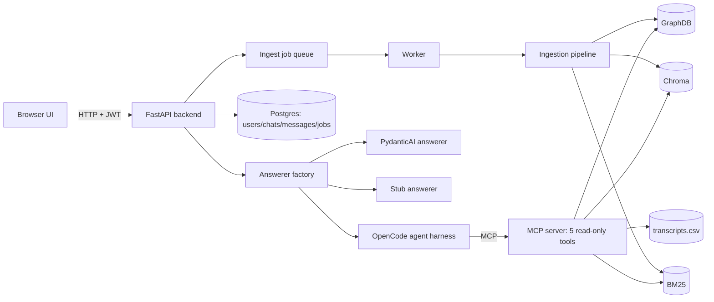
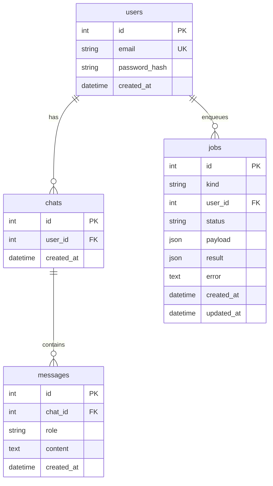
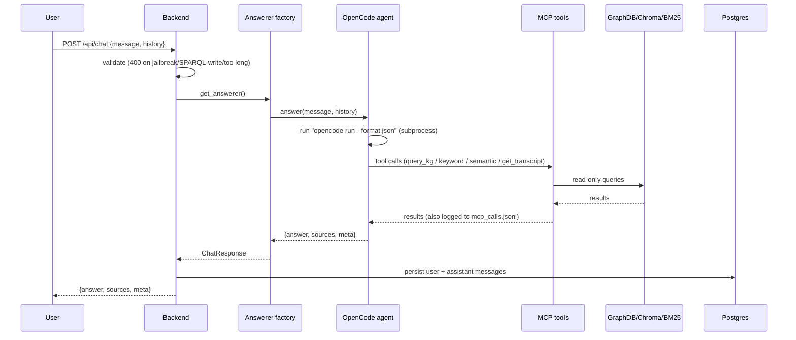
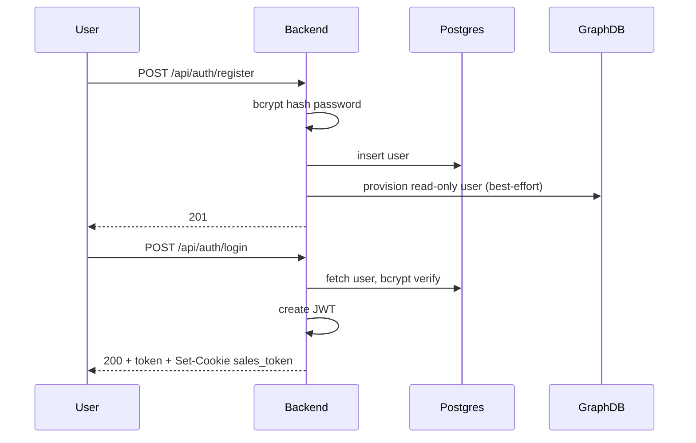
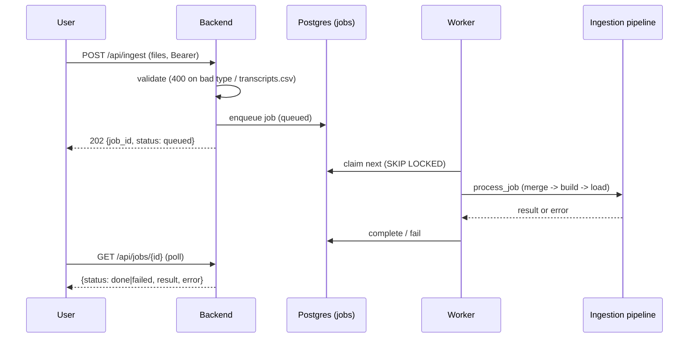
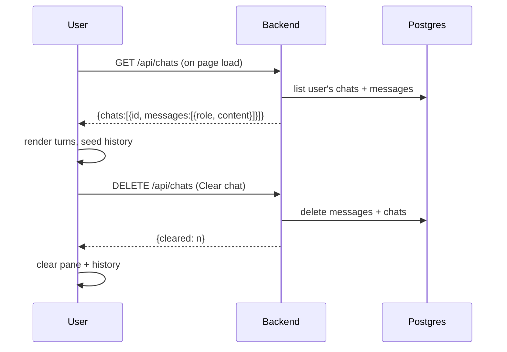

# Architecture — Sales Intelligence Assistant

A prototype that answers sales questions by grounding an LLM agent in a
knowledge graph, a vector index and a keyword index.

---

## 1. What it does

- Answers sales questions about CRM data such as deals, accounts, contacts and transcripts.
- Grounds every answer in real data (KG + transcripts), not the model's memory.
- Lets you upload CRM CSVs and transcript rows (async jobs).
- Shows evidence per answer: which tool, what it found, links into GraphDB.
- Has accounts (register / login), per-user chat history, and "clear chat".
- Blocks dangerous input: SPARQL writes, jailbreaks, oversized prompts.

## 2. Requirements

- **Read-only agent.** The agent can only call 5 retrieval tools. No shell, no
  filesystem, no HTTP, no DB credentials.
- **Grounded answers.** Every factual claim is backed by a tool result, and the
  UI shows the source.
- **Async ingestion.** Uploads return immediately; a worker runs the pipeline.
- **Per-user isolation.** Chats and jobs are scoped to the logged-in user.
- **Deterministic safety first.** A hard validator always runs; the classifier
  is optional.

## 3. Components

- **UI** — two static pages (`index.html` chat, `ingest.html`). Vanilla JS, no
  framework, `data-testid` hooks for Playwright.
- **Backend** — FastAPI (`app/backend/app.py`): `/api/chat`, `/api/chats`,
  `/api/transcripts/{id}`, `/api/jobs`, `/api/ingest*`, `/health`.
- **Answerer factory** — `ANSWERER=agent` (default, OpenCode), `pydantic`,
  `stub` (tests). `baseline` was removed.
- **Agent harness** — `app/agent/opencode.py` runs `opencode run --format json`
  as a subprocess; `system.md` holds the grounding instructions.
- **MCP server** — `app/mcp/server.py`, 5 tools:
  `query_kg`, `semantic_search`, `keyword_search`, `get_transcript`,
  `describe_kg_schema`.
- **Retrieval** — `app/retrieval/`: SPARQL (GraphDB), Chroma (vector), BM25
  (keyword), CSV (transcripts).
- **Ingestion** — `app/ingestion/service.py` + root scripts
  `build.py` (Morph-KGC + SHACL), `extract.py` (LLM → RDF), `index_transcripts.py`
  (Chroma), `load.py` (GraphDB).
- **Queue** — `app/queue/core.py` + `worker.py` (Postgres `SKIP LOCKED`).

## 4. Database schema

- `jobs.kind`: `ingest_csv` | `ingest_transcript`.
- `jobs.status`: `queued` | `running` | `done` | `failed`.
- Schema is `create_all` (no Alembic) + one `ALTER` for `jobs.user_id`.

## 5. Security

- **Auth** — hand-rolled JWT (`PyJWT`, HS256, `sub=user_id`, 60 min). Password
  hashed with `bcrypt`. Login sets `sales_token` cookie (`HttpOnly`,
  `SameSite=Lax`). Requests take the bearer token first, then the cookie (the
  cookie exists so plain `<a>` links to GraphDB stay authenticated).
- **Protected** — `/api/chat`, `/api/transcripts/{id}`, `/api/ingest*`,
  `/api/jobs`, `/api/chats`. **Public** — `/health`, `/api/auth/*`.
- **Read-only GraphDB** — `BLOCKED` keywords reject writes:
  `INSERT DELETE CLEAR DROP CREATE LOAD MOVE COPY ADD` (uppercase only).
- **Prompt safety (3 layers)** — L1 always-on validator: max 4000 chars,
  jailbreak phrases, SPARQL-write regex → 400. L2 sandbox (static test).
  L3 optional classifier (`PROMPT_GUARD=off|classifier`).
- **GraphDB** — security ON with demo creds `reader`/`reader` (read-only) and
  `admin`/`admin` (ingest). Auto-secure at boot, auto-provision a reader per
  registration (`GRAPHDB_AUTO_PROVISION=1`; `0` skips it, used in tests).
- **CORS** — permissive (`*`), dev-only.

## 6. Sequence — ask a question

## 7. Sequence — register / login

## 8. Sequence — ingest a CSV

## 9. Sequence — chat history load + clear

## 10. Trade-offs (from prior sessions)

- **Agent harness = OpenCode**, not a custom loop or LangChain/LlamaIndex.
  Reason: don't build a framework; keep the tool loop, JSON trace and grounding.
- **Evaluated NVIDIA NOOA (OO Agents) and rejected it** for the answerer: its
  tool use is "model writes + executes Python" (CodeAct), which is a security
  downgrade vs our structured read-only MCP tools. Its typed-output win is
  already covered by PydanticAI, which we already ship.
- **Auth = hand-rolled JWT + bcrypt** (no passlib — unmaintained). Cookie
  fallback exists only so GraphDB visual links stay authenticated.
- **GraphDB security ON with demo creds**, published on `7200` for direct
  Workbench links. The authenticated proxy is kept but unused.
- **Auto-provision on register is best-effort and gated** — the HTTP round-trip
  to GraphDB made tests slow, so `GRAPHDB_AUTO_PROVISION=0` in the offline suite.
- **Safety = deterministic deny-list always on, classifier optional.** A
  deterministic validator is testable and fails closed; an ML classifier is not.
- **Three retrieval sources, consult all.** The KG is incomplete (3 of 10
  transcripts never extracted), so the agent must also check keyword + vector.
- **Pure refusals skip the checklist** and the "How I checked" line (no tools,
  no trace) — a refusal is a policy decision, not a fact to ground.
- **Ingestion is async (job queue).** Chosen to stop uploads writing directly to
  the live data dir and to cap concurrency. `SKIP LOCKED` on Postgres, plain
  poll on SQLite.
- **contact_ids required, reject-new + backfill C000.** Chose reject-new over
  auto-inventing on write; backfilled existing T101 rows.
- **Skipped MinIO (M7) and persistence (M8)** — local CSV/`kg.nt`/`chroma_db`
  files are enough for the prototype.
- **Tests offline by default** with a 60s per-test timeout; e2e uses a
  run-unique SQLite DB and an isolated `DATA_DIR` so runs never pollute or collide.

## 11. Config & services

- `app/config.py` — single place for env vars (`GRAPHDB_*`, `DATABASE_URL`,
  `JWT_*`, `PROMPT_GUARD`, `INGEST_CONCURRENCY`, `DATA_DIR`, ...).
- `docker-compose.yml` — `graphdb` (7200), `postgres` (internal), `app` (8000),
  `worker`.
- Data on disk — `DATA_DIR/*.csv`, `kg.nt`, `chroma_db/`, `extracted/*.ttl`,
  `logs/mcp_calls.jsonl`.
